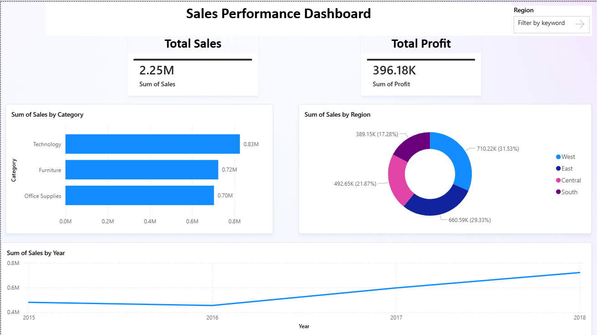

# Sales Data Analysis Project

## 📊 Overview
This project analyzes sales data using Python, SQL, and Power BI to generate business insights.

## 🔧 Tools Used
- Python (Pandas)
- SQL (SQLite)
- Power BI

## 🚀 Features
- Data cleaning and preprocessing
- Sales trend analysis
- Top-performing product identification
- Region-wise revenue insights

## 📈 Key Insights
- Electronics category generated highest revenue
- South region showed strong sales performance
- High-value products contributed major revenue

## ▶️ How to Run
1. Install dependencies:
   pip install -r requirements.txt

2. Run data cleaning:
   python scripts/data_cleaning.py

3. Open notebook:
   notebooks/analysis.ipynb

# 📊 Sales Data Analysis Dashboard

## 🔍 Overview
This project analyzes retail sales data to identify key business insights using Python, SQL, and Power BI.

---

## 🛠️ Tools & Technologies
- Python (Pandas, NumPy)
- SQL (SQLite)
- Power BI
- VS Code

---

## 📈 Key Features
- Data cleaning and preprocessing using Python
- Exploratory Data Analysis (EDA)
- Sales trend analysis (monthly)
- Region-wise and category-wise performance
- Interactive Power BI dashboard with filters

---

## 📊 Dashboard Preview

---

## 📌 Key Insights
- Technology category generated the highest sales
- West region contributed maximum revenue
- Sales show seasonal trends across months
- High-performing sub-categories identified

---

## ▶️ How to Run the Project

1. Install dependencies:

2. Run data cleaning script:

3. Open Jupyter Notebook:

4. Open Power BI dashboard:

sales-data-analysis/
│
├── data/
├── scripts/
├── notebooks/
├── sql/
├── dashboard/
│ ├── dashboard.png
│ └── sales_dashboard.pbix
├── README.md

## 💼 Use Case
This project helps businesses:
- Track sales performance
- Identify top-performing categories
- Monitor regional growth
- Make data-driven decisions
